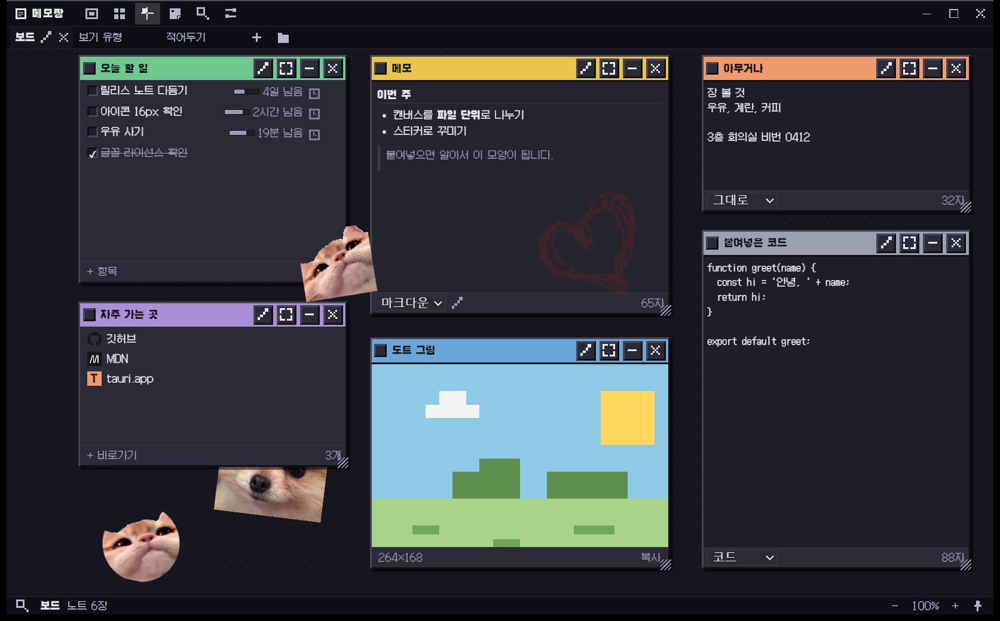
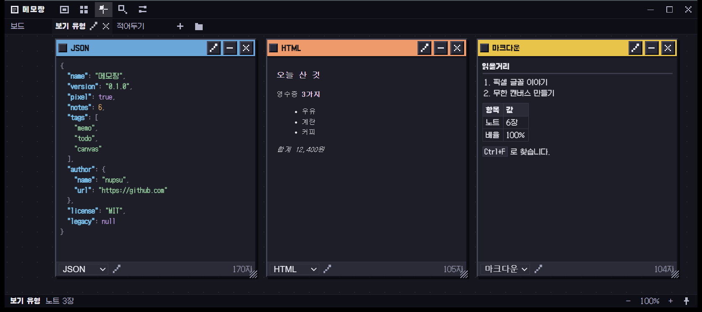
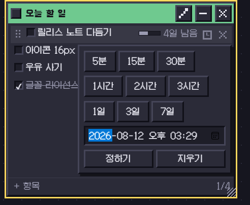
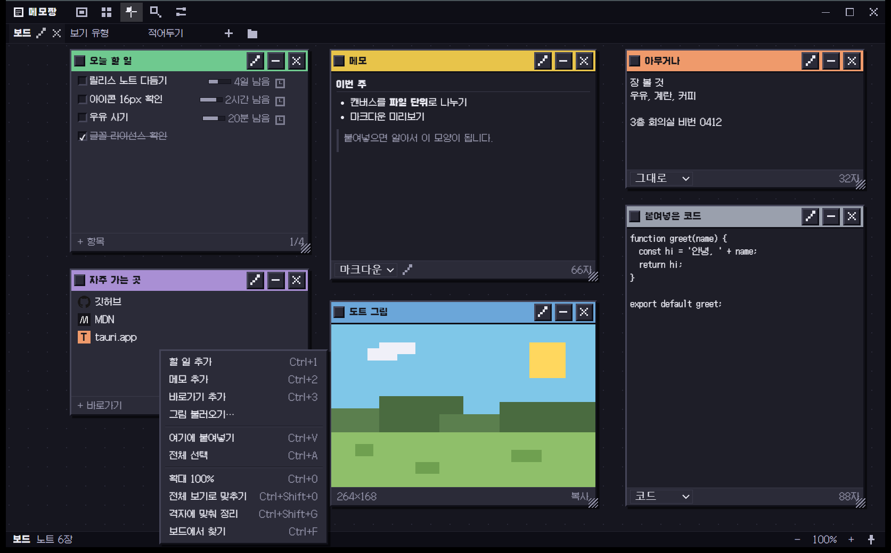
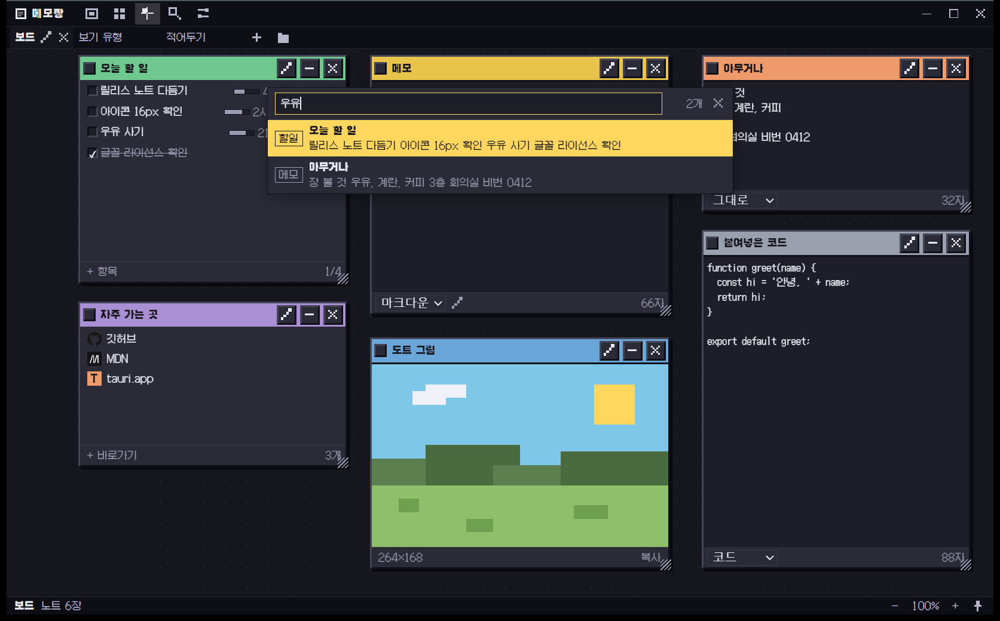
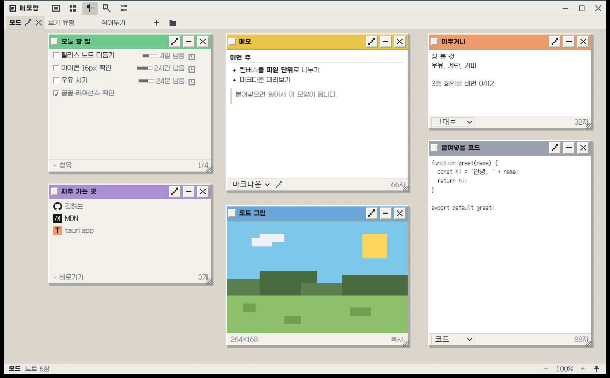
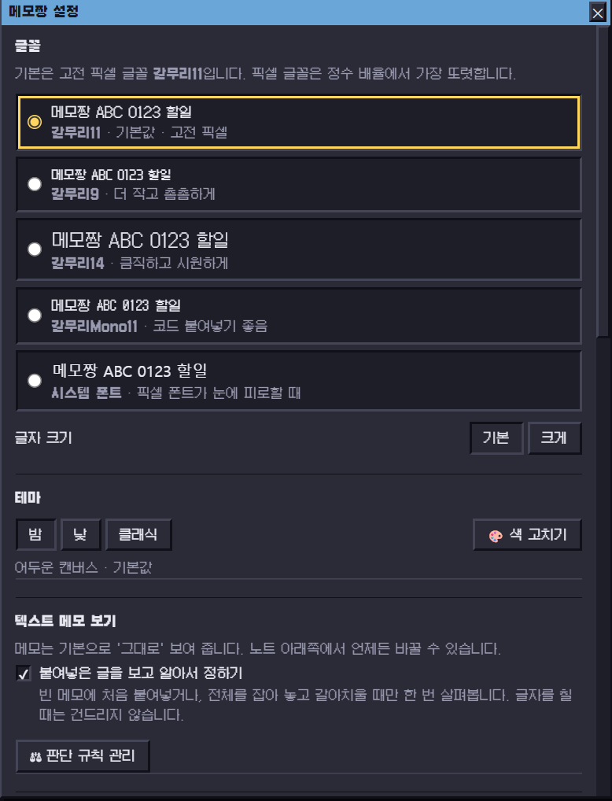
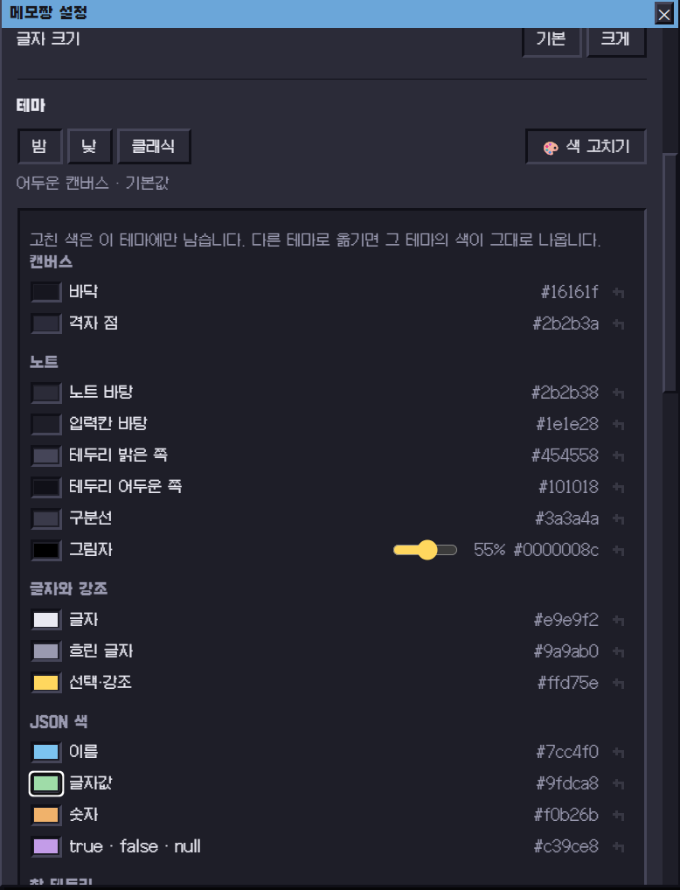
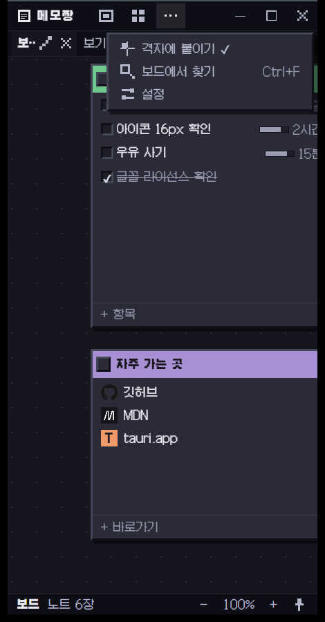

# 메모짱

고전 픽셀 글꼴로 굴러가는, 하나의 커다란 캔버스 위에 **할 일 · 메모 · 바로가기 · 그림**을 아무 데나 붙여두는 데스크톱 앱.

메모장은 너무 심심하고 노션은 너무 거창할 때를 위한 자리입니다.
끝없는 캔버스에 원하는 위치로 툭툭 던져놓고, 끌어서 옮기고 `Ctrl`+휠로 확대·축소하면서 씁니다.

> **AI 로 만든 프로젝트입니다.**
> 코드와 아이콘, 이 문서까지 대부분을 Anthropic 의 Claude 와 함께 썼습니다.
> 무엇을 만들지와 어떻게 동작해야 하는지는 사람이 정하고, 구현과 다듬기를 AI 가 맡는 식으로 진행했습니다.



## 받기

**[→ 최신 버전 내려받기](https://github.com/MyNameIsDabin/MEMOJJANG/releases/latest)**

Windows 10 / 11 (x64). `Memojjang_x.y.z_x64-setup.exe` 를 받아 실행하면 됩니다.
`.msi` 도 함께 올라가니 조직에 배포할 때는 그쪽을 쓰세요.

서명하지 않은 앱이라 처음 실행할 때 SmartScreen 이 한 번 막아섭니다.
**추가 정보 → 실행**을 누르면 됩니다. 소스는 전부 여기 있으니 직접 빌드해도 같은 것이 나옵니다.

## 둘러보기

### 글은 생긴 대로 보여 줍니다

메모 아래쪽 정보줄에서 보기 방식을 고릅니다. 그대로 · 마크다운 · 코드 · JSON · HTML.
JSON 은 보기 좋게 들여쓰고 이름·글자값·숫자·`true`/`false`/`null` 을 색으로 갈라 줍니다.
붙여넣은 글을 보고 알아서 정하게 둘 수도 있습니다.



### 마감은 단추 세 줄로

할 일 항목에 마우스를 얹으면 시계 단추가 나옵니다. 분·시·일 프리셋을 누르거나 날짜를 직접 적으면
목록 오른쪽에 `4일 남음` `20분 남음` 처럼 남은 시간과 진행도 막대가 붙습니다.
왼쪽 손잡이를 끌어 순서도 바꿉니다.



### 노트는 우클릭으로 어디서든



### 노트가 수십 장이 되면 찾기

`Ctrl+F`. 제목과 본문을 함께 뒤지고, 결과를 고르면 그 노트가 화면 한가운데로 날아옵니다.



### 밤 · 낮 · 클래식



### 글꼴과 색은 마음대로

기본 글꼴은 갈무리11 이고, 갈무리9 / 14 / Mono / 시스템 글꼴로 바꿀 수 있습니다.
**색 고치기**를 열면 캔버스 바닥부터 그림자 투명도, JSON 색까지 하나씩 고치고 언제든 되돌립니다.

| 설정 | 색 고치기 |
| --- | --- |
|  |  |

### 좁혀 놓고 써도 됩니다

창을 얇게 줄이면 도구 아이콘이 뒤에서부터 `⋯` 로 접히고, 탭 이름도 줄어듭니다.
접힌 기능은 `⋯` 를 눌러 그대로 씁니다.



## 무엇이 되나

- **캔버스 여러 개** — 캔버스 하나가 파일 하나입니다. 원하는 자리에 만들어 두고 위쪽 탭으로 오갑니다. 업무용·개인용을 나누거나, 프로젝트마다 하나씩 두고 쓰면 됩니다.
- **무한 캔버스** — `Ctrl`+휠로 확대·축소(커서 기준), 빈 곳이나 휠 클릭으로 끌어 이동.
  100%·200% 근처에서는 살짝 붙잡아 픽셀이 또렷하게 유지됩니다.
  **맨휠은 화면을 건드리지 않습니다** — 긴 메모를 굴리다 끝에 닿는 순간 화면이 딸려 움직이거나
  배율이 튀는 일이 없도록, 화면 옮기기는 손으로 끄는 쪽에만 맡겼습니다.
- **노트 네 종류**
  - **할 일** — Enter 로 다음 항목, 빈 항목에서 Backspace 로 지우기. 왼쪽 손잡이를 끌어 순서를 바꾸고,
    시계 단추로 마감을 정하면 남은 시간과 진행도 막대가 붙습니다.
  - **메모** — 그냥 쓰는 칸. 글자를 붙여넣으면 이걸로 만들어집니다. 아래 정보줄에서 **보기 방식**(그대로 · 마크다운 · 코드 · JSON · HTML)을
    고를 수 있고, 붙여넣은 글을 보고 알아서 정하게 둘 수도 있습니다. 그 판단 기준은 설정에서 직접 더하고 뺄 수 있습니다.
  - **바로가기** — 자주 가는 곳을 별칭과 함께 모아 둡니다. 사이트 아이콘이 자동으로 붙고, 누르면 기본 브라우저로 열립니다.
    이 노트 하나만 골라 둔 채로 주소를 붙여넣으면 새 노트가 아니라 **그 목록에 바로 들어갑니다**
    (여러 줄이면 여러 개가 한 번에). 주소가 아닌 글은 평소대로 메모가 됩니다.
  - **그림** — 붙여넣기(`Ctrl+V`), 브라우저에서 그림을 끌어다 놓기, 우클릭 → **그림 불러오기**,
    또는 **캡처해서 가져오기**로 생깁니다. 크기를 바꿔도 원본 비율을 지켜서 잘리거나 남는 자리가 없습니다.
    아래 `✎` 를 누르면 **연필로 덧그릴** 수 있습니다 — 색과 굵기를 고르고, 한 획씩 지우거나 모두 지웁니다.
    덧그린 것은 좌표로만 남아 **원본 파일은 그대로**이고, 노트를 늘리면 그림과 함께 커집니다.
- **이미지 붙여넣기** — 스크린샷을 찍고 `Ctrl+V` 하면 커서 자리에 그대로 붙습니다. 그림은 별도 파일로 저장되고 노트에는 파일 이름만 남습니다.
- **영역 캡처** — 우클릭 → **캡처해서 가져오기**. 화면이 그 순간으로 얼어붙고, 담고 싶은 자리를 끌어서
  고르면 곧바로 그림 노트가 됩니다. 다른 캡처 앱을 거칠 필요가 없습니다. `Esc` 로 그만둡니다.
  모니터가 여러 대여도 전부 한 판으로 덮으며, 노트에 들어가는 조각은 원본에서 오려 내므로 화질을 잃지 않습니다.
- **꾸미기** — 위쪽 도구 줄의 스티커 단추를 누르면 꾸미기 모드가 됩니다. 노트가 흑백으로 옅어져
  잠겼다는 것이 한눈에 보이고, 위쪽에 무엇을 하면 되는지 한 줄로 뜹니다.
  빈 곳을 우클릭해 스티커를 고르면 그 자리에 붙고, 귀퉁이 손잡이를 끌어 **돌리고 키웁니다**(`Shift` 면 크기만).
  왼쪽 아래 고리를 노트로 끌면 그 노트에 **붙어서 함께 움직이고**, 연결선에 마우스를 얹으면
  가위가 되어 누르는 순간 끊어집니다. `Enter` 로 배치를 마칩니다.
  붙일 때는 노트의 **네 모서리와 가운데** 중 한 곳을 고릅니다. 그 자리가 기준점이 되어,
  노트 크기를 바꾸면 스티커가 그 모서리를 따라갑니다 — 오른쪽 아래에 매달아 두면 늘려도 늘 오른쪽 아래입니다.
  아래쪽 도구 줄에서 **자리**(노트 뒤 · 본문 밑 · 노트 앞), **투명도**(슬라이더 또는 숫자), **흑백**,
  **모양**(네모 · 동그라미 · 별)을 고릅니다. '본문 밑' 은 노트 안쪽에 깔려 종이 무늬처럼 보입니다.
- **스티커 꾸러미 주고받기** — 스티커 서랍에서 고른 것만 골라 파일 하나로 **내보낼** 수 있습니다.
  그림 바이트까지 그 안에 담기므로 받는 사람은 파일 하나만 있으면 됩니다 (`.mjsticker.json`).
  **불러오기**로 남의 꾸러미를 그대로 보관함에 담습니다.
- **화면 가득 펼치기** — 노트 제목 줄의 `⛶` 를 누르면 그 노트 하나가 캔버스를 통째로 씁니다.
  창 크기를 바꾸면 본문도 따라 늘어나고, `Esc` 로 원래 자리에 돌아옵니다. 노트의 위치와 크기는 그대로 남습니다.
- **찾기** — `Ctrl+F` 는 제목과 본문을 함께 뒤집니다. 상태 줄 왼쪽의 `🔍`(`Ctrl+Space`)은 노트 목록을 펼쳐
  이름으로 골라 가는 쪽이고, 검색칸은 목록 아래에 붙어 있습니다. `↑` `↓` `Tab` 으로 짚고 `Enter` 로 갑니다.
  어느 쪽이든 노트를 고르면 화면 한가운데로 오고,
  **펼쳐 놓고 보던 중이었다면 그 자리에 고른 노트가 대신 올라옵니다.**
- **새로운 버전** — 설정 맨 위에서 새 버전이 나왔는지 알려 주고, 누르면 받아서 깔고 다시 띄웁니다.
  받은 파일은 서명을 확인한 뒤에만 설치합니다.
- **글꼴 더하기** — 이 컴퓨터에 깔린 글꼴을 이름으로 부르거나, 글꼴 파일을 직접 불러올 수 있습니다.
  불러온 파일은 앱 데이터 폴더로 복사해 두므로 원본을 옮겨도 그대로 남습니다.
- **정리와 스냅** — 겹쳐서 엉킨 보드를 격자에 맞춰 줄줄이 늘어놓거나, 전부 보이도록 확대율을 맞춥니다.
  스냅을 켜면 노트를 놓는 순간 **자리도 크기도** 격자 점에 딱 붙고, 끄는 동안 어디에 놓일지 실루엣으로 미리 보여 줍니다.
- **전역 단축키** — 기본 `Ctrl+Shift+Space`. 어느 프로그램에서든 불러내고 한 번 더 누르면 숨깁니다. 설정에서 원하는 조합을 직접 눌러 바꿀 수 있습니다.
- **고전 픽셀 글꼴** — 기본값은 [갈무리11](https://github.com/quiple/galmuri). 설정에서 갈무리9 / 14 / Mono / 시스템 글꼴로 바꿀 수 있습니다.
- **테마 셋** — 밤(기본) · 낮 · 클래식(그 시절 청록 바탕화면). 설정의 **색 고치기**로 캔버스 바닥, 노트 바탕,
  그림자, 창 테두리 같은 색을 하나씩 직접 바꿀 수 있고 (투명도가 필요한 색은 그것까지), 언제든 기본값으로 되돌립니다.
- **트레이 상주 · 항상 위에 표시** — 닫아도 트레이에 남아 있고, 다른 창 위에 고정할 수 있습니다.
- **클립보드 자동 수집** — 복사할 때마다 보드에 쌓아둡니다. 사생활 문제가 있어 **기본값은 꺼짐**입니다.

## 단축키

| 키 | 하는 일 |
| --- | --- |
| `Ctrl+Shift+Space` | **어디서든** 메모짱 불러내기 / 숨기기 (바꿀 수 있음) |
| `Ctrl+1` `Ctrl+2` `Ctrl+3` | 할 일 · 메모 · 바로가기 추가 |
| `Ctrl+V` | 커서 자리에 붙여넣기 (그림은 그림 노트로) |
| `Ctrl+F` | 보드 안에서 찾기 — 다시 누르면 닫힙니다 (찾기 창에서 `Enter` 도 같음) |
| `F2` | 고른 노트의 이름 바꾸기 |
| `Ctrl+Enter` | 고른 노트를 화면 가득 펼치기 (다시 누르면 접힘) |
| `Esc` | 화면 가득 펼친 노트 접기 · 꾸미기 나가기 · 열린 패널 닫기 · 선택 해제 |
| `Ctrl+Space` | 노트 목록 펼치기 — `↑` `↓` `Tab` 으로 고르고 `Enter` |
| `Ctrl`+휠 | 커서 기준 확대·축소 — 노트 위에 커서가 있어도 됩니다 |
| 휠 | 내용이 넘쳐 스크롤이 생긴 노트 위에서 그 안을 굴립니다 (`Shift` 면 좌우로) |
| **휠 클릭 드래그** | 어디서든 캔버스 이동 — 노트 위에 커서가 있어도 됩니다 |
| 빈 곳 드래그 | 캔버스 이동 |
| `Shift`+드래그 | 여러 개 선택 |
| `Ctrl+D` | 선택한 노트 복제 |
| `Delete` | 선택한 노트 삭제 |
| `Ctrl+Z` / `Ctrl+Y` | 되돌리기 · 다시 실행 |
| `Ctrl+0` | 확대 100% |
| `Ctrl+Shift+0` | 전체 보기로 맞추기 |
| `Ctrl+Shift+G` | 격자에 맞춰 정리 |

노트 제목 표시줄은 어느 자리를 잡아도 드래그가 됩니다 — 버튼 위도 마찬가지고, 움직이지 않고 떼면 그 버튼이 눌립니다.
`✎` 로 이름을 고치고, `⛶` 로 화면 가득 펼치고, `▬` 로 접고, 왼쪽의 작은 네모를 누르면 색이 바뀝니다.
표시줄을 두 번 누르면 접힙니다.

배율과 "항상 위에 표시" 는 아래 상태 줄에 있고, 격자 점 표시처럼 자주 건드리지 않는 것은 설정 안에 있습니다.

창 위쪽은 운영체제 장식을 끄고 앱이 직접 그립니다. 그래야 제목 줄·탭·캔버스가 끊기지 않고 이어집니다.
아이콘도 16×16 격자 위에 직접 그린 것이라 도트 느낌이 유지됩니다 ([`src/ui/Icon.tsx`](src/ui/Icon.tsx)).

## 개발 환경

- **Node.js 20+**
- **Rust (stable, MSVC)** — <https://rustup.rs>
- **Windows**: Visual Studio Build Tools 의 "C++ 데스크톱 개발" 워크로드, 그리고 WebView2 런타임 (Windows 11 에는 이미 있습니다)

```bash
npm install
npm run tauri dev      # 앱으로 실행
npm run tauri build    # 설치 파일 생성 (target/release/bundle)
```

UI 만 손볼 때는 Rust 빌드를 기다릴 필요가 없습니다:

```bash
npm run dev            # http://localhost:1420 - 브라우저에서 바로
```

브라우저 모드에서는 파일 저장 대신 `localStorage` 를 쓰고, 트레이·항상 위에 표시·클립보드 자동 수집은 동작하지 않습니다.

## 구조

```
src/
  types.ts              도메인 모델 (캔버스 파일에 그대로 직렬화됨)
  store/
    boardStore.ts       지금 보고 있는 캔버스의 노트·뷰포트·선택·되돌리기
    canvasStore.ts      캔버스 목록과 전환 — 생성/열기/닫기/이름변경
    settingsStore.ts    설정과 화면 반영
    uiStore.ts          겹쳐 뜨는 패널들의 열림 상태
    effects.ts          자동 저장, 설정 전파 (스토어 바깥의 부수효과)
  canvas/Board.tsx      무한 캔버스 — 팬/줌/격자/올가미 선택
  notes/                NoteShell(공통 껍데기) + 종류별 본문 4종
    detect.ts           붙여넣은 글로 보기 방식 추론 (기본 규칙 + 사용자 규칙)
  actions/
    paste.ts            붙여넣기 (paste 이벤트 · 클립보드 직접 읽기)
    search.ts           보드 안 내용 찾기
    layout.ts           한 노트로 날아가기, 전체 보기, 격자 정리
  platform/
    capture.ts          영역 캡처 — 얼린 화면에서 고른 자리만 오려 오기
    stickers.ts         스티커 보관함 + 꾸러미 내보내기·불러오기
    files.ts            임의 경로 파일 입출력 + 경로 다루기
    canvasFile.ts       캔버스 한 벌(본문 + .assets 그림) 읽기·쓰기
    assets.ts           활성 캔버스의 그림 저장/불러오기
    storage.ts          앱 자신의 상태 (설정, 작업공간)
  theme/palette.ts      테마 색의 유일한 출처 — 기본값, 편집 목록, :root 반영
  ui/
    Toolbar.tsx         아이콘 도구막대 + 좁아지면 ⋯ 로 접기
    useOverflow.ts      몇 개까지 들어가는지 재는 훅
    CanvasTabs.tsx      캔버스 탭 줄
    ThemeEditor.tsx     색을 하나씩 고치고 되돌리는 편집기
    MemoRules.tsx       보기 방식 판단 규칙 관리
src-tauri/src/
  lib.rs                플러그인 등록, 닫기 동작, 명령
  files.rs              임의 경로 파일 읽기·쓰기 (fs 플러그인 범위 밖)
  net.rs                사이트 아이콘 내려받기
  capture.rs            바탕화면을 얼려 찍고 고른 자리를 오려 주기
  tray.rs               트레이 아이콘과 메뉴
  hotkey.rs             전역 단축키 등록과 창 앞으로 끌어내기
  clipboard_watch.rs    클립보드 감시 스레드
```

좌표 규칙 하나만 기억하면 캔버스 코드가 읽힙니다:

```
화면 좌표 = 월드 좌표 × zoom + viewport{x, y}
```

노트는 전부 월드 좌표에 절대배치되고, `transform` 은 바깥 래퍼 한 겹에만 걸립니다.
그래서 노트가 몇 장이든 팬/줌 비용은 그대로입니다.

## 데이터가 저장되는 곳

**캔버스는 직접 고른 자리에** 저장됩니다. 캔버스 하나가 파일 하나입니다.

```
내 보드.mjb.json      노트와 화면 위치
내 보드.mjb.assets/   붙여넣은 그림들 (그림이 생길 때만 만들어집니다)
```

그림을 본문에 박아 넣지 않는 이유는 자동 저장 때문입니다. 저장할 때마다 파일을 통째로 다시 쓰는데,
그림이 몇 장만 들어가도 매번 수 MB 를 쓰게 됩니다. 대신 **캔버스 파일을 옮길 때는 `.assets` 폴더도 함께 옮겨야 합니다.**

앱 자신의 상태만 `%APPDATA%\com.memojjang.app\` 에 남습니다:

```
settings.json     글꼴·테마·단축키 같은 설정
workspace.json    어떤 캔버스를 열어 뒀는지 (경로 목록)
```

이 폴더를 지워도 메모는 날아가지 않습니다 — 탭 목록만 잃을 뿐이고, 캔버스 파일을 다시 열면 됩니다.
설정 창의 **캔버스 파일 위치 열기**로 지금 캔버스가 어디 있는지 바로 갈 수 있습니다.

## 사이트 아이콘에 대해

바로가기 노트의 아이콘은 파비콘 대행 서비스를 거치지 않고 **사이트에서 바로** 가져옵니다.
어디를 즐겨찾는지가 제3자에게 새어 나가지 않도록 하기 위해서입니다.
`/favicon.ico` 와 `/apple-touch-icon.png` 를 차례로 두드려 보고, 둘 다 없으면 글자 타일로 대신합니다.

이 때문에 앱의 CSP 중 `img-src` 에만 `https:` 가 열려 있습니다. 그림은 실행되지 않으므로
스크립트를 여는 것과는 위험이 다르고, 나머지(`script-src`, `connect-src`)는 그대로 잠겨 있습니다.

## 클립보드 자동 수집에 대해

켜면 다른 프로그램에서 복사한 내용까지 보드에 쌓입니다. 편하지만 비밀번호 관리자에서 복사한
암호 같은 것도 함께 남을 수 있어 **기본값은 꺼짐**이며, 수집된 내용은 이 컴퓨터 밖으로 나가지 않습니다.

Windows 에서는 `GetClipboardSequenceNumber` 로 변경 여부만 확인하기 때문에 감시 비용이 사실상 없습니다.
다른 운영체제에서는 텍스트만 수집합니다.

## 라이선스

- **코드**: MIT — [`LICENSE`](LICENSE)
- **글꼴**: [갈무리](https://github.com/quiple/galmuri) — SIL Open Font License 1.1.
  전문은 [`public/fonts/Galmuri-OFL.md`](public/fonts/Galmuri-OFL.md) 에 함께 담겨 있습니다.
  글꼴은 MIT 가 아니라 OFL 을 따르므로, 배포할 때 이 파일을 빼면 안 됩니다.

함께 담긴 것들의 라이선스는 [`NOTICE.md`](NOTICE.md) 에 정리해 두었습니다.
      